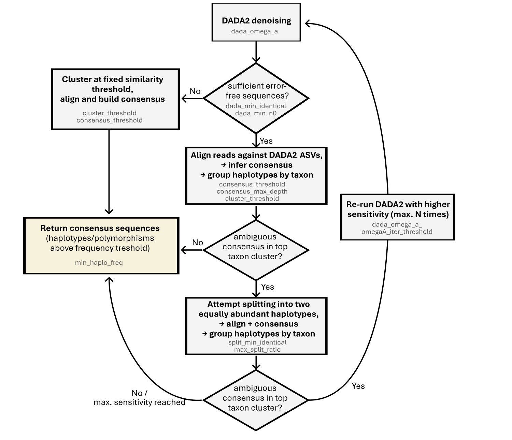
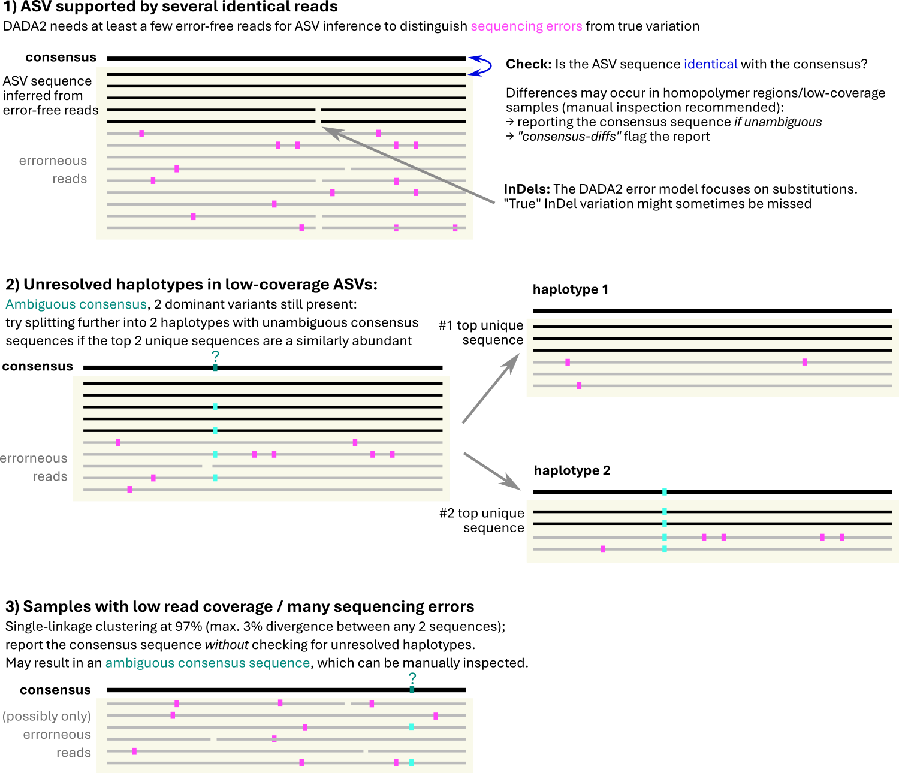

# Nanopore barcoding workflow

## Steps

1. Search the primers and short sample indexes (located up-/downstream of the primer sequences)
2. Infer the barcode sequences with [DADA2](https://benjjneb.github.io/dada2) and/or fixed-threshold clustering (for low-coverage variants), align and infer the consensus
3. Auto-assign the taxonomy and compare with the name given by morphological identification (if present) to validate and check for contamination.
4. Compare with already known sequences (if present)
5. Export summary table, which can be further manually curated

More details are given in `analysis.Rmd`, or the generated report.

## Details on the clustering

The procedure starts with DADA2 clustering, followed by an alignment to the inferred ASV sequence and consensus building. Additional steps may follow depending on whether the consensus is unambiguous (each alignment column supported by enough identical bases), or not.

All the settings are documented on top of the *get_barcodes* function in [cluster.R](https://github.com/markschl/dada-ont-barcoding/R/cluster.R). The defaults can be changed in the `cluster` section of `config.yaml`.

### Steps/strategies

1. **DADA2 denoising** works well if there are enough error-free sequences in the cluster. 
   The consensus sequence is always reported (in the *Curation* section of the report).
   If the consensus does not match with the ASV sequence, there is a *consensus-diffs* issue is reported
   (see [curation](curation.md#list-of-issues)).
   Different sensitivity settings are tested sequentially if necessary (see workflow above).
2. **Haplotype splitting**: Before attemting a more sensitive denoising, it is checked ASVs
   with an ambiguous consensus, whether they can be split into two more or less abundant
   *unambiguous* sub-sequences. This often works quite well.
3. **Fixed-threshold clustering**: if there is not enough duplication in the top ASV(s),
   fixed-threshold clustering is applied instead (single-linkage, 97% by default)

#### Taxa grouping

single-linkage fixed-threshold clustering (default: 97% similarity = max. 3% divergence between any sequence) of the clusters (ASVs) is used to group multiple polymorphisms/haplotypes together by taxon. This usually works well at least with the ITS barcode, but can be configured.

> The most problematic case would be if two closely related taxa are present in the DNA extract. Then, the sequence polymorphism may not be accurately recognized.

#### Taxonomic assignments

Taxonomic names are automatically assigned with the the [SINTAX algorithm](https://doi.org/10.1101/074161) using a reference database defined in `config.yaml`.

Second, any morphological identifications are compared to these taxonomic assignments. From this, a **taxonomic overlap** is calculated, which is the *proportion of matching ranks in the taxonomic lineages* (as far as names are defined at these levels). The lineages are retrieved from the [GBIF backbone](https://doi.org/10.15468/39omei) taxonomy.

Inconsistent taxonomic labels are flagged in the report, and potential **contaminants** are automatically down-ranked in the mix if (i) the names were blacklisted in `config.yaml`, or (ii) there exists a less abundant taxon, which has at least *three more consistent (matching) taxonomic ranks* in the GBIF lineage compared to the top taxon (undefined ranks excluded from the comparison).
