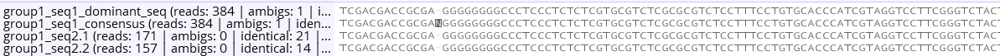
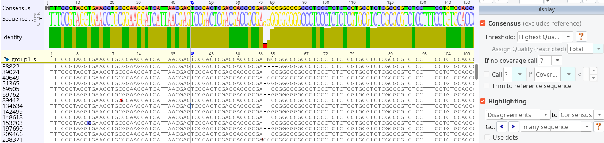

# Report

The results of the automated analysis are saved in an Excel document named **report.xlsx**. There is one row per barcode, the columns are explained by comments in the document.

The **issues** list should be investigated more closely, although not all of them are critical. The list can be filtered.

## Final sequence set

The *seq1*, [*seq2*, etc.] columns in the **Curation** section contain the final sequences. In case of problems, they can be edited. Changed sequences appear in [blue]{style="color:blue"}. Ambiguous sequences appear in [purple]{style="color:#bb34bd"}.

> FASTA sequences can be exported by a simple copy&paste from the *FA1* [*FA2*, etc.] columns to a text file (works well with LibreOffice).

> **Excel:** copy&paste to a *Word document*, then copy&paste to the final text file or search field, etc. *OR*: copy directly to a text file, then remove all double quotes (") with search&replace.

# Common problems

## Inconsistent taxonomy

The **tax-mismatch** issue indicates a mismatch between the taxonomic name in the *morpho-taxon* entry and the sequence-based identification. Possible reasons:

- mis-identified specimen
- something got mixed up when preparing specimens/extracting/amplifying
- the automatic taxonomy assignment of barcode sequences did not work correctly, or the taxonomic lineages obtained from GBIF are not correct
- contamination not automatically recognized

It is advisable to check the *details* worksheet: Copy the sample barcode combination (e.g. *bc018-bc183*) and filter the *details* table to list *all* sequences from this sample. The *group* column indicates the taxon cluster (the top being the one shown in the main table).

> If the top taxon group is not the correct one, copy from the "sequence" field(s) to "seq1" ("seq2", ...) in the main table (paste values).

> The **contamination** issue indicates that contamination is very likely present and was automatically down-ranked. It may also be good to investigate these samples more precisely in the *details* tab.

## Ambiguous consensus

If the alignment consensus has ambiguous positions (*ambig-consensus* issue), these may be inspected.

> If the *alignemnts: separate* setting was active when running the pipeline, there will be a *→ data* link to open a folder with BAM alignment files. Use a sequence viewer of your choice, e.g. Geneious, CLC Workbench or UGENE.

The *...seq_comparison.fasta* file may be inspected first. Inconsistencies should be readily visible (example alignment view in Geneious).

The BAM file (and the corresponding reference consensus sequences) offer additional insights:

> If necessary, copy the **correct sequence** to the *seq1* (*seq2*, etc.) column in the *Curation* section.
> It will become [blue]{style="color:blue"} to indicate that something has been changed.

## Complete list of issues

Not all issues are critical, some messages just provide more context. 

- **ambig-consensus:** At least one of the top taxon consensus sequences have ambiguities, suggesting either unresolved sequence variation, or sequencing errors (the *consensus_threshold* setting strongly influences whether this issue appears, see `infer_barcode()`)

- **tax-mismatch:** Inconsistency found between the name in the *morpho-taxon* column and the *auto-assigned taxon* (see also "matching ranks" column). Strong inconsistencies might indicate a preparation error or contamination, although contamination is often automatically recognized.

> Note that the automatic taxonomy is not always correct; it depends on the reference database and the *confidence_threshold* setting (`do_assign_compare_taxonomy()`).

- **contamination:** The most abundant taxon is suspected to be a contaminating sequence and was therefore ignored. This happens if the prepared specimen was not "pure", and DNA from the host or another specie was co-amplified. The most abundant taxon is still listed in the "details" sheet, and manual inspection of at least part of the putative contaminants is recommended to ensure that there are no errors in the automatic ranking (see also *contam_rank_delta* setting, `do_assign_compare_taxonomy()`)

- **known-seq-diffs:** There is at least one mismatch between the top taxon and the provided "known" sequence. To investigate, look for "..._seq_comparison.bam".

- **known-seq-contamination:** The provided "known" sequence appears to be a contamination itself

- **many-variants:** Strong sequence variability for the top taxon (>4 abundant variants above the frequency threshold). Maybe multiple individuals are present in the DNA mix?

- **low-coverage:** Only few Nanopore sequences support the top taxon. Low-coverage samples may have more ambiguities, and there is a higher risk for errors (possibly investigate the BAM alignments) (see also *low_abund_threshold*, `create_excel_report()`)

- **< 3 times overabundant**: The top taxon is less than 3x more abundant than the second taxon. It may be worth to check for contamination.

- **Related taxa in mix**: The taxonomy assignment suggests that there are several related taxa present in the same sample. It may be worth to check for contamination to be sure that the top taxon is actually the one you are looking for.

- **Re-mapping to consensus gives another consensus** (very rare): During the clustering workflow, consensus sequences were not identical before and after a re-mapping of reads. Consider inspecting the alignments.

Not necessarily real *issues*:

- **[consensus-diffs]:** At least one of the top taxon consensus sequences does not match the *dominant sequence*. This is not necessarily an issue (as the consensus is always reported) but is an indication for noisy data and/or low-depth samples.

- **[homopolymer-fix]:** At least one of the top taxon consensus sequences contains one or several long homopolymer stretches (≥ 6 bp), where the consensus was not unambiguous, since Nanopore has difficulties in determining the correct repeat length. Instead of the consensensus, the sequence was taken from the prevalent sequencing read (`fix_homopolymers()`).
